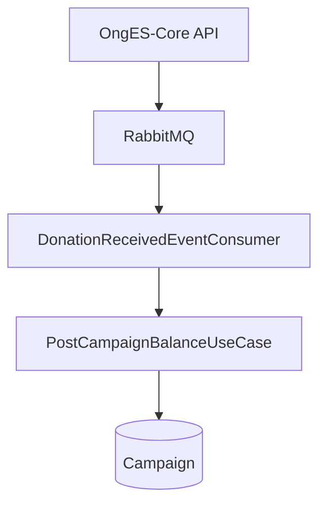

# OngES-Worker

Worker assíncrono da plataforma **Conexão Solidária**, desenvolvido para a ONG Esperança Solidária. É responsável por consumir os eventos de doação publicados pelo [OngES-Core](https://github.com/PAIFteam/OngES-Core) e atualizar o valor arrecadado da campanha correspondente.

Projeto desenvolvido durante a **Fase 5 (Hackathon)** da Pós-Graduação em Arquitetura de Sistemas .NET da FIAP, pelo grupo **PAIF Team**.

---

## Arquitetura



A API **OngES-Core** registra a doação e publica um evento no RabbitMQ. O **OngES-Worker** consome esse evento de forma assíncrona e atualiza o saldo arrecadado da campanha, mantendo o desacoplamento entre a API e a lógica de processamento financeiro.

---

## Fluxo da aplicação

```text
Cliente realiza uma doação
        │
        ▼
OngES-Core valida os dados
        │
        ▼
Registra a doação no banco
        │
        ▼
Publica evento no RabbitMQ
        │
        ▼
OngES-Worker consome o evento
        │
        ▼
Atualiza o saldo da campanha
        │
        ▼
Confirma processamento (ACK)
```

---

## Princípios adotados

- Clean Architecture
- Event-Driven Architecture
- Dependency Injection
- Repository Pattern
- Asynchronous Messaging
- CQRS (Use Cases)
- SOLID

---

## Arquitetura interna

| Projeto | Responsabilidade |
|---|---|
| `OngES-Worker.API` | Host da aplicação, configuração do RabbitMQ, DI e Swagger |
| `OngES-Worker.Core` | Regras de negócio, entidades, casos de uso e interfaces |
| `OngES-Worker.Infra` | Persistência (Dapper/SQL Server) e integração com RabbitMQ |

---

## Tecnologias

- .NET 8
- SQL Server
- RabbitMQ
- MassTransit
- Dapper
- MediatR
- Swagger (habilitado apenas em ambientes não produtivos)

---

## Estrutura do projeto

```text
src/
├── Dockerfile
├── OngES-Worker-API.sln
└── Service/
    └── OngES-Worker/
        ├── OngES-Worker.API/
        ├── OngES-Worker.Core/
        └── OngES-Worker.Infra/
```

---

## Pré-requisitos

- .NET 8 SDK
- RabbitMQ
- SQL Server

Este projeto utiliza a mesma infraestrutura do **OngES-Core**, incluindo banco de dados e filas RabbitMQ.

---

## Configuração

Configure a conexão com o banco de dados e o RabbitMQ no arquivo:

```
src/Service/OngES-Worker/OngES-Worker.API/appsettings.json
```

Exemplo:

```json
{
  "ConnectionStrings": {
    "DB_SQL_ONGES": "<connection-string>"
  },
  "RabbitSettings": {
    "HostName": "localhost",
    "Port": 5672,
    "UserName": "<username>",
    "Password": "<password>",
    "QueueName": "donation_received_queue",
    "QueueNameConsumer": "donation_received_queue",
    "StartConsumer": true
  }
}
```

> **Importante**
>
> Não utilize credenciais reais no arquivo versionado. Para ambientes locais, recomenda-se utilizar arquivos de configuração ignorados pelo Git, como `appsettings.Local.json`, ou variáveis de ambiente.

---

## Executando localmente

```bash
cd src

dotnet restore OngES-Worker-API.sln

dotnet run --project Service/OngES-Worker/OngES-Worker.API
```

Após iniciar:

1. Execute também o **OngES-Core**.
2. Registre uma nova doação pela API.
3. O Worker consumirá automaticamente o evento publicado no RabbitMQ.
4. O saldo da campanha será atualizado no banco de dados.

---

## Roadmap

Funcionalidades previstas para evolução do projeto:

- [ ] Pipeline de CI/CD
- [ ] Testes automatizados
- [ ] Docker Compose para toda a solução
- [ ] Manifestos Kubernetes
- [ ] Observabilidade (Health Checks, Metrics e Grafana)
- [ ] Ajustes no Dockerfile para geração da imagem da aplicação

---

## Licença

Projeto desenvolvido exclusivamente para fins acadêmicos durante a Pós-Graduação em Arquitetura de Sistemas .NET da FIAP.
